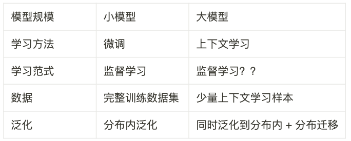
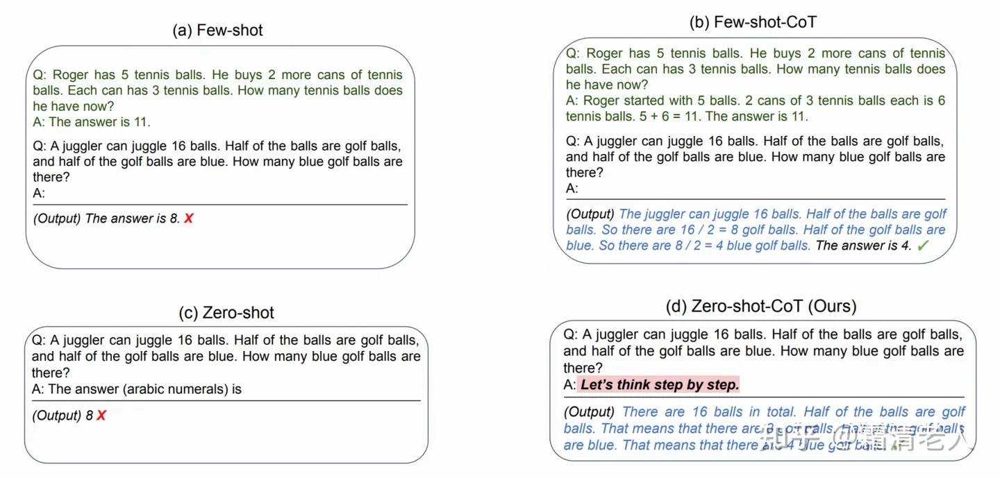

## 基本背景

- 目标读者： 假定目标读者一对 Generative AI 有一定的了解和产品使用经验，因此本文中将不再对任何基础性知识进行赘述。
- 研究目的： 该文旨在结合检索文献和实践经验来梳理当前 Generative AI 领域的现状与边界，勘误常见的一些错误观念，并着重强调现状和边界中蕴涵的行业机会。
- Out of Bounds: 不考虑任何尚未发生的技术颠覆或突破所可能于行业造成的影响，仅以现有技术的线性发展作为前提。

## 事实核查

### 大模型的参数量越大是否必然越好？

结论：语言模型的参数量，语料大小和最佳损失（即模型效果）之间符合一个凸曲线。参数量并不是越大越好。

证据：

1. Deepmind的观点 [https://arxiv.org/abs/2203.15556](https://arxiv.org/abs/2203.15556) 

[语言模型参数越多越好？DeepMind用700亿打败自家2800亿，训练优化出「小」模型](https://www.jiqizhixin.com/articles/2022-04-03-2)

1. 同样基于 T5 架构，13B参数量的 mt0-xxl-mt 在大多数场景下实测表现不如 11b参数量的 flan-t5。（两者都是经过 instruction fine tuning 的）

反面观点：

[Scaling Laws for Neural Language Models](https://arxiv.org/abs/2001.08361)

对反面观点的证伪：

[New Scaling Laws for Large Language Models - LessWrong](https://www.lesswrong.com/posts/midXmMb2Xg37F2Kgn/new-scaling-laws-for-large-language-models)

Given the evidence of Chinchilla, it appears pretty definite that OpenAI got the scaling laws wrong. So one natural question is "What happened that they got it wrong?"

Well, background: The *learning rate* of a deep neural network dictates how much the parameters of a network are updated for each piece of training data. Learning rates on large training runs are typically decreased according to a schedule, so that data towards the end of a training run adjusts the parameters of a neural network less than data towards the beginning of it. You can see this as reflecting the need to not "forget" what was learned earlier in the training run.

It looks like OpenAI used a single total annealing schedule for all of their runs, even those of different lengths. This shifted the apparent best-possible performance downwards for the networks on a non-ideal annealing schedule. And this lead to a distorted notion of what laws should be.

### 大语言模型是否可以彻底替代所有的小模型？

来源： ‣ 

[Why did all of the public reproduction of GPT-3 fail? In which tasks should we use GPT-3.5/ChatGPT?](https://jingfengyang.github.io/gpt)

- 对于大多数的传统NLP任务，fine tuning后的 FLAN-T5-11B 效果要好于 GPT3.5
    - 相同数据集训练的、相同参数量的bloomz 和 mt0 的表现上也能观察到相似的情况
    
    [Is ChatGPT a General-Purpose Natural Language Processing Task Solver?](https://arxiv.org/abs/2302.06476)
    
- 对于机器翻译任务，LLM 的整体表现依然不如
- 越「反常识」的任务大模型的效果越差。较小的模型可能可以更好地适应反事实知识。

### 大语言模型如何与外部知识进行结合？

[https://github.com/jerryjliu/gpt_index](https://github.com/jerryjliu/gpt_index)

[https://github.com/hwchase17/langchain](https://github.com/hwchase17/langchain)

- 对大模型的输入输出进行前置&后至处理，诸如外部上下文
- 通过词嵌入向量的方式建立索引，以便实现上下文片段的抽取

[https://github.com/mukulpatnaik/researchgpt](https://github.com/mukulpatnaik/researchgpt)

Facebook 发布了 

[Toolformer: Language Models Can Teach Themselves to Use Tools](https://arxiv.org/abs/2302.04761)

直接让 LLM 学会调用外部工具的API

### 大模型的风险与解决方案

大模型所采用的数据集有被低成本投毒的风险：

[Poisoning Web-Scale Training Datasets is Practical](https://arxiv.org/abs/2302.10149)

有一些方法可以检测文本是否有语言大模型生成（基于统计学特征）：

[A Watermark for LLMs - a Hugging Face Space by tomg-group-umd](https://huggingface.co/spaces/tomg-group-umd/lm-watermarking)

大模型可能对于现有内容监管造成大的影响。

[互联网信息服务深度合成管理规定_信息产业（含电信）_中国政府网](http://www.gov.cn/zhengce/zhengceku/2022-12/12/content_5731431.htm)

### 开源大模型的现状

bigscience 开源了基于 BLOOM 架构（架构上高度类似 GPT）的 bloomz 和基于 t5 的 mt0 模型，bloomz 最大参数量 176B，mt0 最大参数量 13B。 但实际性能不佳（原因是数据集质量相对较差，没有进行比较好的清洗。）

google开源了 11b参数量的 flan-t5，是目前开源模型中质量最佳的。 在生成任务上不如 gpt3.5，但在 NLP 和推理任务上接近甚至超过 gpt3.5.（来源：基于实际测试）

更多参考资料：

[Language Models vs. The SAT Reading Test](https://jeffq.com/blog/language-models-vs-the-sat-reading-test/)

[追赶ChatGPT的难点与平替](https://mp.weixin.qq.com/s/eYmssaPFODjC7xwh1jHydQ)

### 开源大模型的推理成本

- 11B参数量的 flan-t5 以 8bit 精度已经完全能够在消费级显卡上跑起来（如 24g显存的3090，已在 runpod 上进行验证，直接基于 transformers）
- 175B参数量的 OPT 通过一些特殊的优化（https://github.com/FMInference/FlexGen）也可以勉强在消费级显卡上跑起来，实际可用需要 A100 单卡。
- 

[DeepSpeed: Accelerating large-scale model inference and training via system optimizations and compression - Microsoft Research](https://www.microsoft.com/en-us/research/blog/deepspeed-accelerating-large-scale-model-inference-and-training-via-system-optimizations-and-compression/)

- • **Effective quantize-aware training** allows users to easily quantize models that can efficiently execute with low-precision, such as 8-bit integer (INT8) instead of 32-bit floating point (FP32), leading to both memory savings and latency reduction without hurting accuracy.

[LLM.int8(): 8-bit Matrix Multiplication for Transformers at Scale](https://arxiv.org/abs/2208.07339)

### 如何度量大模型的性能

多任务的测试集：

[https://github.com/google/BIG-bench](https://github.com/google/BIG-bench)

## 展望与观点

### 大模型是一个患有 ADHD 的孩子

- 对于大模型的fine tuning 很多时候并不是为了让模型习得更多的知识，而是反过来去收敛大模型因为知识太多所造成的过于发散。
- 思维链之所以有效果，很有可能是因为起到了收敛注意力的作用。

### 图片生成模型距离商业化场景还有多远？

- midjourney 的方向并不能满足商用需求，专业设计师对于景深、镜别的包括有很高的要求，因此让 AI 能够理解 Prompt 中提到的「景深、镜头、技法」，甚至像「一只特立独行的猪的速写，猪在画面左侧三分之二的位置」这样的长句，要远比让 AI 可以给像「smart is the new sexy」这样简单抽象的短语生成出看似不错但千篇一律的图片更有意义。
- https://github.com/lllyasviel/ControlNet 和 https://github.com/TencentARC/T2I-Adapter 的出现将极大的加快图片生成领域的商业化速度

### 国产大模型的核心挑战

- GPT3中仅含有 0.16% 的中文语料（[https://github.com/openai/gpt-3/tree/master/dataset_statistics](https://github.com/openai/gpt-3/tree/master/dataset_statistics)）但已经产生了相当好的效果。（[https://deepai.org/publication/crosslingual-generalization-through-multitask-finetuning](https://deepai.org/publication/crosslingual-generalization-through-multitask-finetuning)） 也提到「在带有英语提示的英语任务上微调大型多语言语言模型可以将任务泛化到仅出现在预训练语料库中的非英语语言。使用英语提示对多语言任务进行微调进一步提高了英语和非英语任务的性能，从而产生了各种最先进的零样本结果。我们还研究了多语言任务的微调，这些任务使用从英语机器翻译的提示来匹配每个数据集的语言。」
    - 仅依赖于中文语料训练出来的大模型，未必在中文表现上能由于多语言模型。
- 做好 RLHF 对于复现 GPT3 的效果可能有非常大的意义，目前国内这块的研究相对有限。
    - [https://mp.weixin.qq.com/s/eYmssaPFODjC7xwh1jHydQ](https://mp.weixin.qq.com/s/eYmssaPFODjC7xwh1jHydQ)
    - [https://huggingface.co/blog/rlhf](https://huggingface.co/blog/rlhf)
    - [https://openai.com/blog/chatgpt/](https://openai.com/blog/chatgpt/)

### 大模型对于云厂商的影响

- 应用层需要低成本的按需计费的推理能力
- T4级别的显卡已经不能满足大模型推理的需求
- 类似 [https://replicate.com/](https://replicate.com/) 的产品有很大的机会

### 大模型对于数据标注产业的影响

- 高质量的小数据集的效果要远好于比海量的大数据（在视觉模型上有过实践测试），现有的标注产业的人员能力可能难以满足大模型的要求。
    - 同样基于 t5 架构 相同参数量下， mt0-3.7b 表现不如 mt5-3.7b。（由于数据质量的问题）
    - 产业机会： [https://toloka.ai/cn/](https://toloka.ai/cn/)
    - [https://scale.com/rlhf](https://scale.com/rlhf)
    - rlhf需要更专业的标注人员，他们通常是具有行业知识的领域专家
    
    [Andrew Ng: Farewell, Big Data](https://spectrum.ieee.org/andrew-ng-data-centric-ai)
    

### 大模型甚至可以被运用到机器人领域

[ChatGPT for Robotics: Design Principles and Model Abilities - Microsoft Research](https://www.microsoft.com/en-us/research/publication/chatgpt-for-robotics-design-principles-and-model-abilities/)

[A Generalist Agent](https://arxiv.org/abs/2205.06175)