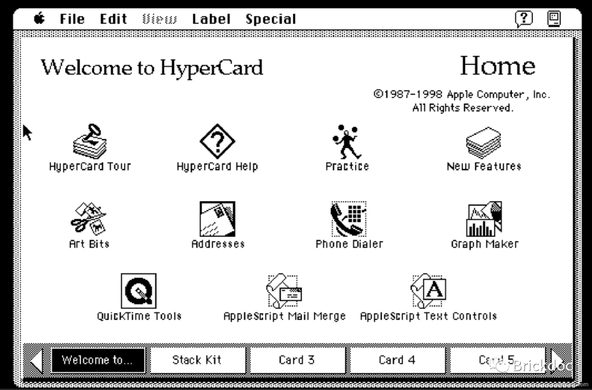
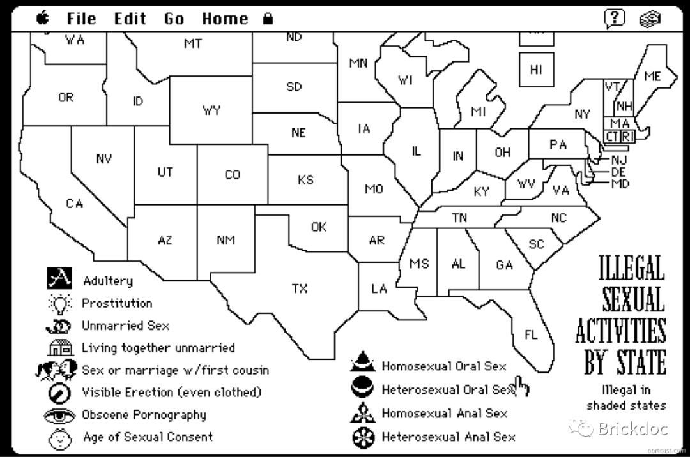
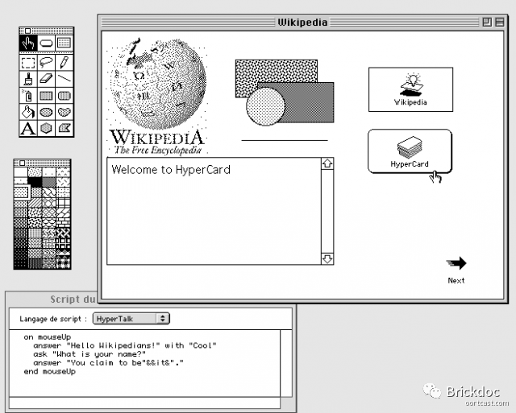
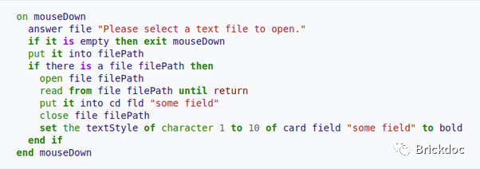

时光回到 1980 年，占地面积将近 40 平方米的 IBM 大型机 System/370 尚属于那一时代无可匹敌的黑科技，然而其所能提供的 CPU 主频仅仅不到 iPhone 11 的百分之一。25 岁的史蒂夫·乔布斯（Steve Jobs）在公共演讲中用了「思想的自行车」一词来隐喻个人电脑的未来之路。但从 39 年后的今天去看，事实上我们所获得的是一辆「思想的火车」——不同于自行车，火车只能在预先铺设好的轨道上照着计划好的时间表前行。

1987 年苹果公司推出了一款叫做 HyperCard 的神奇软件——包括苹果公司自身在内，没有任何人能真正说清楚这是一款提供了什么样功能的软件。有人认为他是一个轻量级的数据库和支持超文本的笔记软件，有人认为它是类似于 Flash 或 PowerPoint 的多媒体文档创造工具，还有人觉得它是一个能够让「麻瓜用户」也可以轻松上手的软件开发工具。而它的诞生同样具有传奇色彩，HyperCard 起源于苹果公司早期的灵魂人物之一——比尔·艾金森（Bill Atkinson）一次服用了致幻物质后的梦境里。

它生如夏花之绚烂，彼时的世界第一高楼——吉隆坡双子塔的照明系统使用它进行控制。法国汽车巨头雷诺亦使用它开发了库存管理系统。沃德·坎宁安（Ward Cunningham）受到它的启发，而创建了人类历史上的第一个 Wiki 站点。Javascript 一开始也只是在 Web 环境中对于 HyperCard 和 HyperTalk 的简单模仿。乃至于蒂姆·伯纳斯-李爵士（Sir. Tim Berners-Lee）和他的同事罗伯特·卡里奥（Robert Cailliau）亦是依靠 HyperCard 的启发而创造了世界上第一个浏览器，开启了 Web 时代的大门。人们使用它管理公司，设计演示文档、制作类似《隐形守护者》这样的交互式文字游戏，乃至于用它「开车」。

它亦死如秋叶之静美，乔布斯于 1997 年重返苹果后收缩产品线，砍掉了大多数项目而 HyperCard 不幸亦在其中。（一种江湖传言认为「乔布斯之所以砍掉 HyperCard 是因为苹果的前 CEO 吉尔·阿梅里奥（Gil Amelio）是 HyperCard 的忠诚粉丝」。）它正埋藏于上古科技界的故纸堆里而不为世人所周知，也没有真正意义上的后来者能够提供与之完全匹敌的功能。

正如其名，卡片（Card）是 HyperCard 中最为核心的概念。在 HyperCard 的世界里，每个独立的文件被称为 Stack。每个 Stack 则由若干个 Card 所组成——正如每个 PPT 文件由若干个页面所组成一样，但区别在于绝大多数PPT 中的页面都是线性关联的——一页接着一页，而每个 Stack 中的卡片则常常是以一种类似于「超链接」的非线性方式组织到一起。

HyperCard 还拥有类似于「金数据」、「麦客」的表单系统，用户可以通过托拽的方式完成表单的设计。但不同于 PDF 中的电子表单， HyperCard 的数据层实际上与 Access、SQLite 等单机型的关系型数据库更为相似，所有的变更都将实时的持久化在 Stack 文件中。

而作为 HyperCard 中的脚本语言，某种意义上 HyperTalk 可以被视为 HyperCard 中最为令人惊叹的设计。HyperTalk 是一种事件驱动的脚本语言，拥有极为接近于自然语言的语法。当用户在 GUI 中调用操作时（例如点击按钮或修改字段的值）HyperCard Runtime 会将这些操作转换为事件，随后 HyperTalk 脚本将通过监听事件来执行响应的操作。很大程度上这便是现代 HTML DOM 事件模型最早的灵感源泉。

不同于当今的各类低代码开发平台或 RPA 工具， HyperCard的最伟大之处则在于—— 它是一个可以用来开发程序的「PPT」，而不是一个操作更傻瓜的「IDE」。用户可以轻松上手继而创造出有价值的生产力工具，而无需了解操作系统的任意细节。在 HyperCard 的之前或之后，编程或多或少都是专业程序员的专有领域。正如维基百科中的评论所言:「HyperCard 是苹果努力生产自行车的最高点，用户使用该工具稍加努力就能获得远远超出预期的结果。开源编程的精髓就是使编程变得如此容易，以使任何人都可以涉足创建软件的世界。」